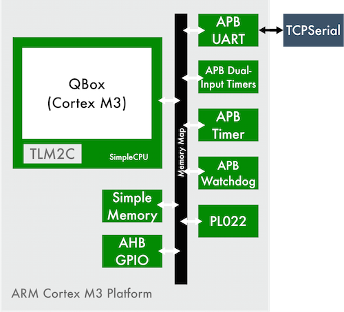

# README

## Overview



This platform contains the following SystemC models:

* **ARM Cortex M3 QBox** (Containing ARM Cortex M3 + System controller) + **TLM2C** and **SimpleCPU**
* **SimpleMemory**
* **AHB GPIO**
* **APB Dual-Input Timers**
* **APB Timer**
* **APB Watchdog**
* **APB UART**
* **PL022**

and the following backend:

* **TCP Serial**

## What is QBox?

Please see [the QBox README](http://git.greensocs.com/qemu/qbox).

## Requirements

QBox requires:

 - git > 1.8.2
 - systemc 2.1.0 to 2.3.1
 - cmake > 2.8
 - libboost > 1.40
 - python dev
 - glib2 dev
 - pixman dev
 - lua 5.2 dev
 - swig

Official OS support:

 - Linux :
  * Ubuntu 12.04 and 14.04
  * CentOS 6 and 7
 - OS X : soon
 - Windows with MinGW

## Requirements

### Linux

**Ubuntu / Debian :**

```sh
$ sudo apt-get install cmake libboost-dev python-dev libglib2.0-dev libpixman-1-dev liblua5.2-dev swig
```

**CentOS / Fedora :**

```sh
$ sudo yum install cmake boost-devel python-devel glib2-devel pixman-devel lua-devel swig
```

### Windows

Please try to install packages in paths without spaces.

* [MinGW](http://sourceforge.net/projects/mingw/) with MSYS
* [CMake](http://www.cmake.org/download/)
* [Boost](http://www.boost.org)
* [SWIG](http://www.swig.org/download.html)
* [LUA](http://www.lua.org/download.html)
* [SystemC](http://www.accellera.org/downloads/standards/systemc/)

With MinGW Installer, install these following packages:

**MinGW**

* gcc
* gcc-g++
* libz-dev
* pthreads-w32-dev

**MSYS**

* flex
* bison

You also need:

* pkg-config
* glib
* libpixman
* mman

You can compile these packages using sources and Google or you can download binaries (fastest).

`pkg-config`, `glib` and `libpixman` can be found here : [GTK Download](http://www.gtk.org/download/win32.php).

You can find `mman` here : [mman](http://sourceforge.net/projects/gtk-mingw/files/mman-win32/)

Then, install packages (copy / paste files) in your MinGW installation.

*Optional*: If you're on Windows **and** you want to use Boost ASIO and/or Boost Thread with TCP Serial, you need to use a Boost library version for MinGW that you can easily build. Just download sources, then run:

```bash
bootstrap.bat mingw
b2 install toolset=gcc --prefix=[output path] --build-type=complete
```

Example:

```bash
bootstrap.bat mingw
b2 install toolset=gcc --prefix=c:/Projects/boost-1-58-0/mingw/ --build-type=complete
```

## Download

Be sure to clone the repository, including the sub-modules (see below).
After cloning the repository, you should run:

```sh
$ git submodule update --init
$ cd libs/qbox
$ git submodule update --init dtc
$ cd ../..
```

## Build

```sh
$ cmake [options]
```

This will result in generating the `Makefile` to build the platform.

Available options are:

* `CMAKE_INSTALL_PREFIX`[^CMAKE_INSTALL_PREFIX-default] : Specify install directory used by install.
* `SYSTEMC_PREFIX` : Specify SystemC prefix (Otherwise, CMake will scan `SYSTEMC_HOME` environment variable)
* `LUA_LIBRARIES` : Specify LUA libraries directory (where is located lua.a, lua.dll, ...).
* `LUA_INCLUDE_DIR` : Specify LUA header directory (where is located lua.h).
* `BOOST_ROOT` : Specify Boost directory.
* `SWIG_DIR` : Specify SWIG directory (where is located swig binary).
* `SWIG_EXECUTABLE` : Specify SWIG binary path.
* `-G` : Specify build tools. Currently, we only support "Unix Makefiles".

*Note* : If you're using CentOS 6, you need to add `-DBoost_NO_BOOST_CMAKE=ON` option
[^CMAKE_INSTALL_PREFIX-default]: Default value is `/usr/local`

### Example

#### Linux

```sh
$ cmake -DCMAKE_INSTALL_PREFIX=build -DSYSTEMC_PREFIX=/usr/local/lib/systemc-2.3.1/
```

#### Windows

```sh
cmake -DCMAKE_INSTALL_PREFIX=build
-DSYSTEMC_PREFIX=/c/Projects/systemc-2.3.1 \
-DLUA_LIBRARIES=/c/Projects/lua-5.2.4/src/liblua.a
-DLUA_INCLUDE_DIR=/c/Projects/lua-5.2.4/src/ \
-DBOOST_ROOT=/c/Projects/boost-1-57-0/ \
-DSWIG_DIR=/c/Projects/swigwin-3.0.5
-DSWIG_EXECUTABLE=/c/Projects/swigwin-3.0.5/swig.exe \
-G"Unix Makefiles"
```

Then compile:

```sh
make
```

This action will result in the compilation of the platform.

## Installation

```sh
$ make install
```

## Run

Change directory to your install dir :

```sh
$ cd build/bin
$ ./toplevel --conf [platform.lua]
```

```platform.lua``` is the path to your platform conf file. You can find some examples in ```conf/``` directory.

*Note:* On Windows, you need to edit default platform configuration. You need to change QBox library suffix, ie update line:

```lua
library = "libqbox-cortex-m3.so"
```

to

```lua
library = "libqbox-cortex-m3.dll"
```

## Running

The serial UART connects on port 1236. Port 1236 corresponds to the console.

Once the system starts, you have 7 seconds to connect to that port before the system will continue, so that you can see the output from the system as it boots.
The simplest way of doing this is with telnet.

Hence

```sh
$ telnet localhost 1236
```

You may also use nc and cat to move files into the system.
On your host (where you are running the simulation), you shoud copy the file into the guest using the command:

```sh
$ nc localhost 1236 < FILE_TO_SEND
```

## Contributing

Cortex M3 platform is an open source and community-driven project. If you'd like to contribute, please feel free to fork project and open merge request or to [send us] patch.

[contact us]:http://www.greensocs.com/contact
[send us]:http://www.greensocs.com/contact
